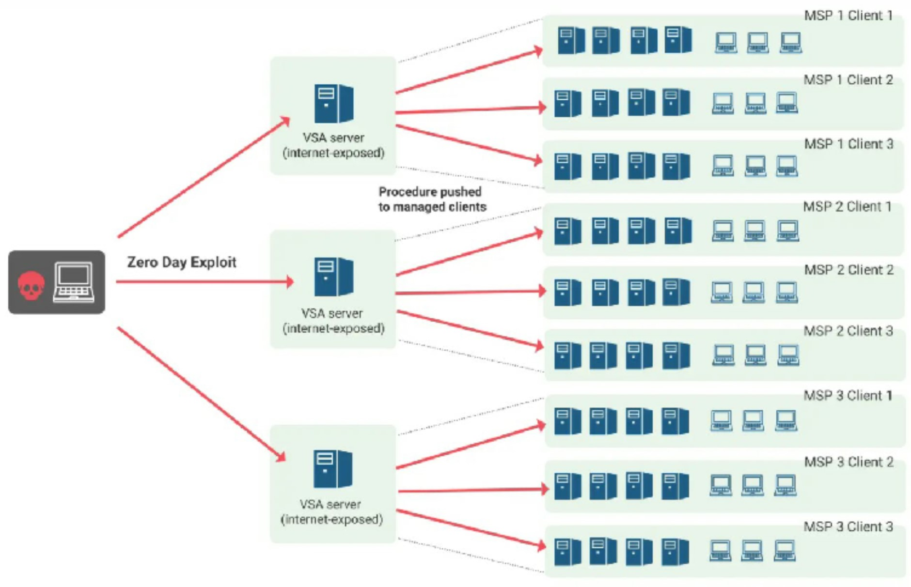
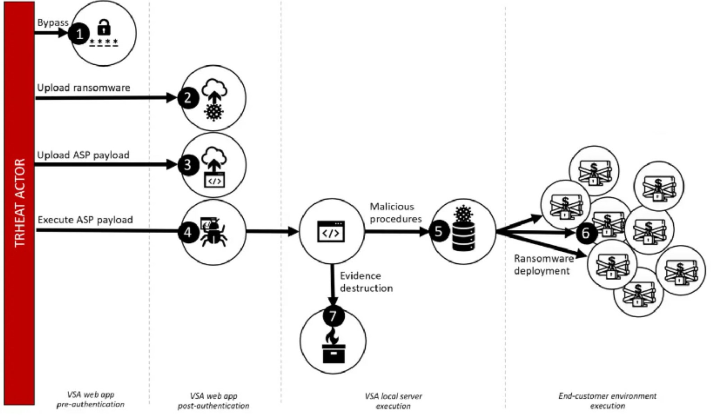
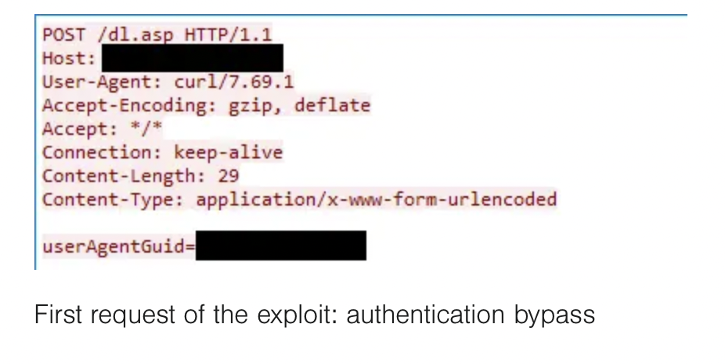
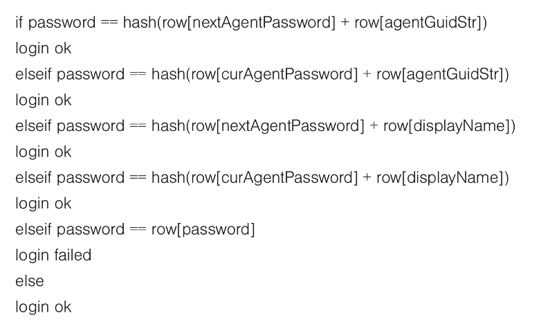
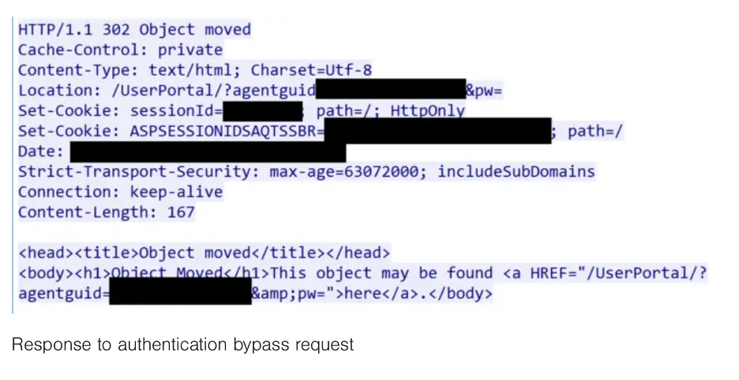
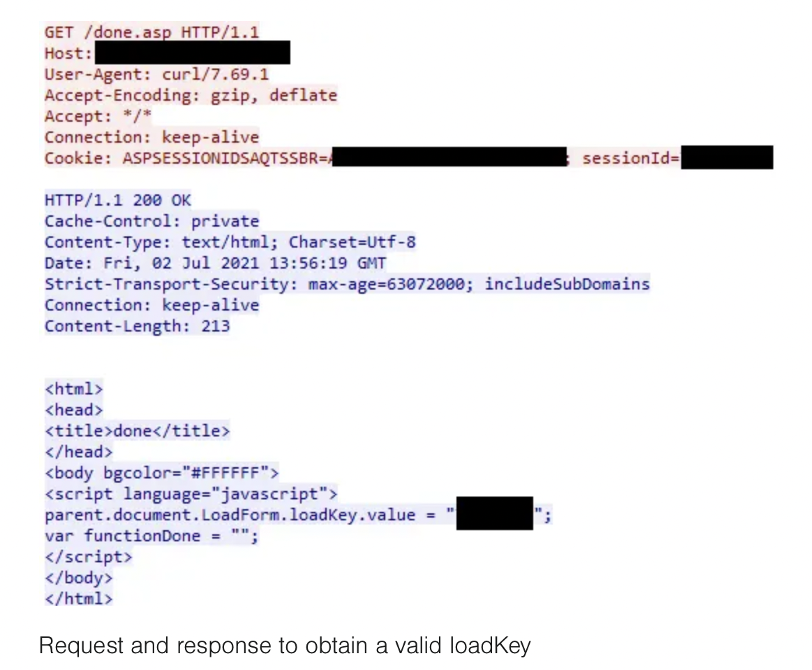
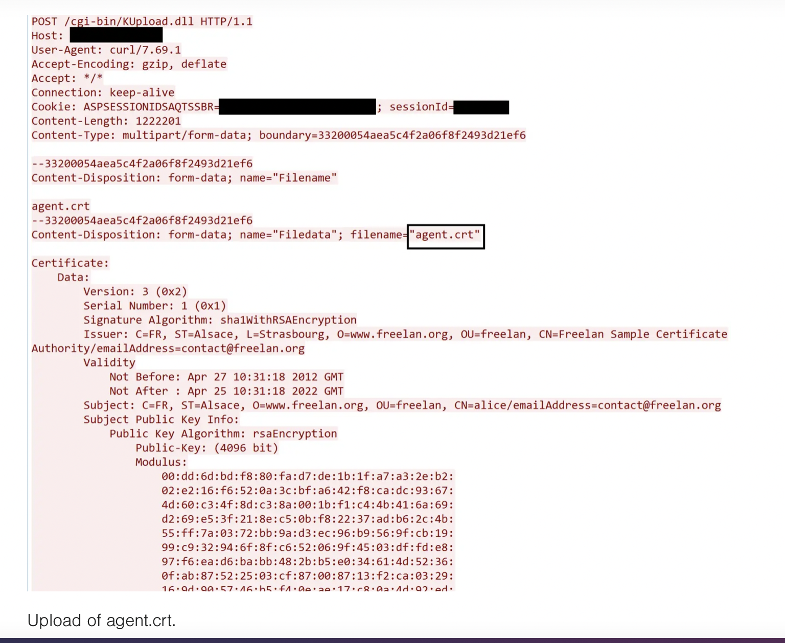
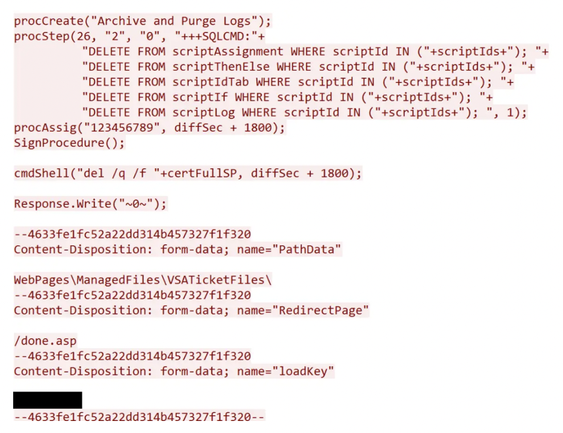
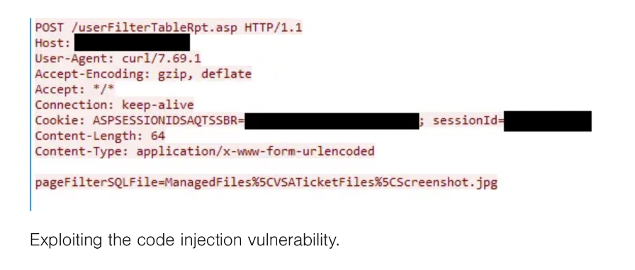

# CVE-2021-30116 _ Kasaya Supply Chain Attack

## Background
On July 2, 2021, hundreds of companies using Kaseya Virtual System Administrator (VSA) as their client IT management product,  became the victims of an extensive ransomware attack that hijacked and used Kaseya’s vulnerability to send a malicious script to all the end clients and encrypt their systems.[^1] 
[^1]:(https://www.tenable.com/blog/cve-2021-30116-multiple-zero-day-vulnerabilities-in-kaseya-vsa-exploited-to-distribute-ransomware)

Kaseya clients from large enterprises to small companies across 17 countries had been hit by this devastating supply chain attack before they could even get a warning. The Swedish supermarket giant Coop had the worst hit by having to shut 800 of its stores worldwide. Also, in New Zealand, many kindergartens and schools had to be knocked offline.
This sophisticated attack was developed by REvil, one of the most powerful ransomware-as-a-service (RaaS) that develops ransomware payloads and provides the victims with decryption tools after getting paid. For revealing a universal decryption key, The REvil claimed to demand $70 million dollars and guaranteed that all victimized companies would be able to recover their files. Since Managed Service providers(MSPs) are usually less mature businesses they have weak unsecured programs.[^2] 
[^2]:(https://www.truesec.com/hub/blog/kaseya-supply-chain-attack-targeting-msps-to-deliver-revil-ransomware)
These companies, by leveraging Kaseya’s software, make it an irresistible and easy to exploit target in extortionists’ eyes.
Here is a brief discription to VSA and MSP. 

#### Kaseya Virtual System Administrator (VSA)
Kaseya VSA is a remote monitoring and management (RMM) software that helps MSPs increase profitability. Moreover, it helps IT departments to get the most out of what they do. It boosts up IT teams by getting rid of inefficiency with an all-in-one endpoint management so they can progress even more than before. Managed Service Providers (MSPs) benefit from this program to remotely control and administer IT services demanded by customers. [^3] 
[^3]:(https://www.kaseya.com/products/vsa/)

#### Managed Service Provider (MSP)
MSP is a third-party company that remotely manages a customer's information technology (IT) infrastructure and end-user systems. MSP’s services may include network and infrastructure management, security and monitoring.

## Attack Overview
This attack impacted Kaseya customers who used the on-premise VSA server. The VSA server is typically used by MSPs to handle all of their clients and is used to manage huge fleets of computers. As illustrated below in fig.1, all client environments are not separated, so, if the VSA server is compromised, all client environments handled by this server are also vulnerable.
Furthermore, if the VSA server is connected to the internet, any vulnerability could be exploited to gain access to the server. 
A zero-day vulnerability in the VSA server was discovered and exploited by the threat actor, an affiliate of the REvil ransomware-as-a-service. A zero-day vulnerability is a defect in software or a network that hasn't been fixed or for which there isn't a patch. The vendor of the programme or device may or may not be aware of the problem. When a defect is publicly disclosed, it increases the danger of cyberattacks against businesses that use the software or device. 
The vulnerability was used to send a malicious script to all computers managed by the server, therefore reaching all of the end users. The script infected computers with the REvil malware and encrypted them.

            
## How the Kaseya VSA Zero-Day Exploit Worked
The pre-auth remote code execution exploit against Kaseya VSA Server that was exploited in the widespread Revil ransomware attack on July 2, 2021 is described as follows. Following the validation of the patch and confirmation that the attack vector is no longer active. The exploit took advantage of four vulnerabilities in the Kaseya programme, which were chained together as shown in the figure below:

[^4]
[^4]:(https://www.truesec.com/hub/blog/kaseya-supply-chain-attack-targeting-msps-to-deliver-revil-ransomware)

In the next section we will focus on the high-level steps of the exploit and describe steps 1 through 4 in detail:

### Step 1 – Bypassing Authentication [CWE-304]

The threat actor first sent a POST request to the resource /dl.asp with the POST data userAgentGuid=guid.

[^5]
[^5]:(https://www.truesec.com/hub/blog/kaseya-vsa-zero-day-exploit)

userAgentGuid is used in a SELECT query in dl.asp to look up the agent's database row. Because of the if statement that follows, the agentGuid must exist. The threat actor used the agentGuid of the VSA server's own agent.
Following the lookup, dl.asp checks to determine if the provided password matches the database information for that agent. After then, the submitted password is compared in a variety of ways. The following pseudo code depicts the login flow:

Logging in will fail if the password is the same as [password]. If all of the checks fail, the else clause is invoked, setting "loginOK" to true.
The "password" variable would be NULL because no password was provided in the request, and loginOK would be true. When loginOK is set to true, the application transmits the login session cookie and eventually ends up in an if clause that provides a 302 redirect to the userPortal (if no other parameters are provided, like in the attacker's request).

#### How Did the Actor Obtain the AgentGuid?
There is no evidence that shows exactly how these agentGuids were obtained. It appears they simply knew the agentGuids before launching the attack.
<vsa_server_hostname>.root.kserver might have been used as the userAgentGuid parameter instead of an actual agentGuid. If agentGuid is not a number, it will look up the agentGuid from the table machNameTab automatically.

### Steps 2 and 3 – Uploading Files [CWE-434][CWE-352]
The threat actor initiated the upload by making an empty GET request to /done.asp. When the programme receives the request, it generates a row in the tempData table, sets up an upload folder, and then returns a loadKey value. To upload the file, you'll need a valid loadkey.

The threat actor used a multiform-data POST request to the resource /cgi-bin/KUpload.dll to upload files. The following parameters were included in the request:

*	FileName (name of the file)
*	FileData (content of the file to upload)
*	LoadKey (the value obtained by GETting done.asp)
*	RedirectPath (path that the application will redirect to after successful upload)
*	PathData (folder the file will be saved in)
*	_RequestValidationToken (bypassable CSRF token)

#### Uploading the Ransomware (Agent.crt)
The threat actor uploaded a file called agent.crt as the first file. This file included an encoded version of the ransomware, which was eventually distributed to all agents via the compromised VSA server.

Upon successful upload, the server returns HTTP 200 OK with a body containing a link pointing to /<redirectPath>?FileName=<filename>&PathData=<relative path>&originalName=<filename>&FileSize=<size>&TimeElapsed=<time>.
            
#### Uploading the ASP Payload (Screenshot.jpg)
Screenshot.jpg uploaded by the threat actor. This, however, was not an actual jpeg picture, but rather a text file containing ASP code. Another loadKey value was obtained from /done.asp. After that, the threat actor uploaded the file. The request’s contents can be seen in the figure below. 

            
 /done.asp? was the response body link in this case.
            
### Step 4 – Executing the Payload on the Server [CWE-94]
Finally, the threat actor used the pageFilterSQLFile parameter in a POST request to /userFilterTableRpt.asp.

 
            
The contents of the provided file would be treated as ASP code when it was passed to the function eval due to a bug in userFilterTableRpt.asp. The ASP code text file the threat actor just uploaded is ManagedFiles/VSATicketFiles/Screenshot.jpg in this case.
The first thing userFilterTableRpt.asp does is create a variable from the POST parameter. The contents of the specified file are then read and passed to eval, which will interpret the value of the argument as code by definition. The following pseudo code depicts the flow:
f = open (pageFilterSQLFile) 
c = read (f) 
eval (c)

That is all there is to it. The ransomware was distributed when the ASP payload was executed.
            
### The actions took by Kasaya to tackle the issue?
*	Although the company had not received any vulnerability report from SaaS or customers, it immediately shut down the SaaS servers as a precaution measure.
            
*	It also sent out emails and made phone calls to alert  its on-premises clients and advising them to take down their VSA servers.
            
Kaseya and other parties immediately advised to the affected customers:
1.	To avoid future compromise, firms with on-premises VSA servers should first shut them down.
2.	Second, organizations are able to download and run a Penetration Testing Tool, which scans a VSA server or managed endpoint for signs of compromise (IoC). This tool's latest version additionally checks for data encryption and the REvil ransom note. As such, even firms who have previously run the product should run the new version.
3.	Third, CISA and the FBI suggested affected MSPs to implement and a multi-factor authentication (MFA) on all their accounts, restrict their communication with remote monitoring and management (RMM) and set up RMM administrative interfaces behind a VPN or a firewall.
4.	Fourth, organisations need to make sure to update backups and store them in an apprachable, air-gapped location isolated from the main network, implement a manual patch management process that goes after vendor guidance and instals new patches as soon as they become available, and apply the basis of least privilege access to main network administrator accounts.

            
            

            

            
            
            
           
            
            
            
            

